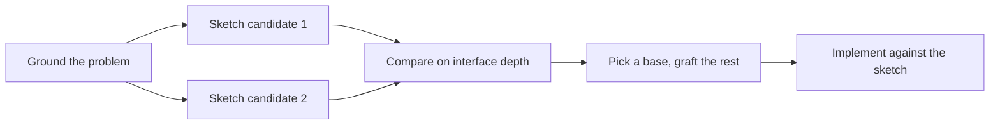

# Design before you write code

One attempt at a hard design locks in the first shape the model thought of. `/architect` settles types and boundaries before implementation. `/interrogate` has other models try to break the result.

## Settle the shape with `/architect`

```text
/architect design the import pipeline before writing any code. i care most about how callers use it.
```

[`/architect`](../../skills/architect/SKILL.md) grounds itself first, running `/how` over the code the design touches and `/why` when it moves ownership or layers. Then it sketches the design at least twice, with the caller's usage written first in each, followed by types, signatures, and a module map. It picks one sketch as the base, folds in what's worth keeping from the others, and records what it rejected and why.



Two structurally distinct candidates are the minimum, even when the first looks sufficient. Whole-shape alternatives, not point fixes inside one shape. Where the agent can reach several models, it runs one candidate per model in parallel; divergence between them is the whole point.

By default it proceeds straight from the synthesized design into implementation. If you want to see the design first, say so:

```text
/architect with checkpoint. stop and show me before implementing.
```

If implementation keeps producing friction the sketch can't absorb, `/architect` throws the sketch out rather than bolting fixes onto a wrong design. The trigger is a repeated pattern of the same workaround, not one hard case.

## Break it with `/interrogate`

```text
/interrogate the whole branch, but skeptically. no nitpicks unless it's an actual bug or regression.
```

[`/interrogate`](../../skills/interrogate/SKILL.md) sends the same diff, intent, and rubric to several reviewers on different model families. Model diversity is the point. Different models have different blind spots, so a finding two models raise independently is high-confidence signal. The lead sorts everything into `Act on`, `Consider`, `Noted`, and `Dismissed`, with a reason for each dismissal, and applies nothing automatically.

Read the dismissals too. The lead is a pragmatic senior engineer, not an oracle, and you can override it.

## Let the TypeScript rules load themselves

[`typescript-best-practices`](../../skills/typescript-best-practices/SKILL.md) has no slash command in your workflow. It loads whenever the agent touches a `.ts` or `.tsx` file and turns the type-system principles into concrete rules: discriminated unions, `unknown` at boundaries, exhaustive variants, schema-derived types.

## How much design work does a task deserve?

You might be wondering whether every change needs this. No. Most changes need none of it. A rough ladder:

- A small, finished change you're unsure about needs [`/review`](../../skills/review/SKILL.md) alone.
- A finished change you want actively attacked, by models that don't share one blind spot, gets `/interrogate`.
- A change that crosses function boundaries or moves ownership earns `/architect`.
- A contested design that's expensive to reverse gets `/architect`, then `/interrogate` before shipping.

Next: [Review and ship](./04-review-and-ship.md).
