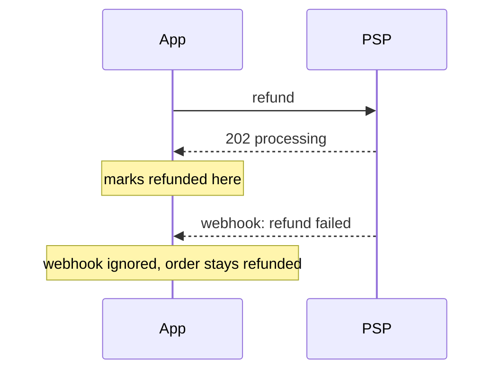

# Views for a failure outline

Pick the smallest view that shows the path from trigger to symptom. Mark the step that goes wrong with `<-- here` and a few words. Keep only the calls, files, fields, and states the reader needs to follow the failure.

- The path through the code as a call tree. Mark the failing step.

```text
handleWebhook
  parseEvent
  findOrder
  applyRefund
    order.status = REFUNDED     <-- here: runs before the refund is confirmed
  ack
```

- The decision that takes the wrong turn as pseudocode. Show what actually happens.

```text
on(refund event)
  if event.status is "processing"
    mark order refunded         <-- here: "processing" is not "done"
  else
    mark order refund failed
```

- A bug between two systems, or in ordering, as a sequence diagram.



- Which module owns the decision, as a shallow file tree.

```text
server/payments/
├── refund.ts          # sends the refund, writes status   <-- here
├── webhook.ts         # receives PSP updates, never reads status
└── status.ts          # the status enum
```

- What got stored wrong, as a diff of the row or the data shape.

```diff
 order
   id: ord_123
-  status: REFUND_PENDING
+  status: REFUNDED          # written from the 202, never corrected
   refundedAt: null
```

- The fix, as a diff of pseudocode or the real code, whichever is shorter and still exact.

```diff
 on(refund event)
-  if event.status is "processing"
+  if event.status is "succeeded"
     mark order refunded
+  else if event.status is "processing"
+    keep REFUND_PENDING
   else
     mark order refund failed
```

- Expected against actual, side by side, only when the contrast is the fastest way to land it.

```text
expected                      actual
--------                      ------
search -> price -> book       search -> price -> book
                              price is 0 for infants   <-- here
```

Place each view under one line of text saying what it shows. Order the views in the order things happen. Do not draw a view that does not contain the marked step or the changed line.
